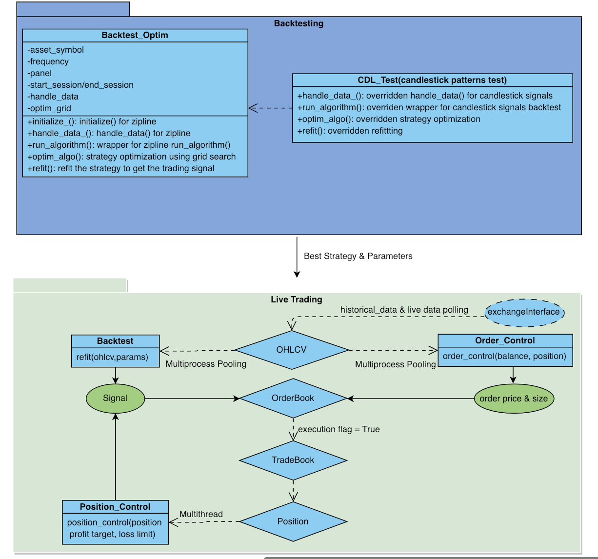

# yigebot
Backtest, strategy optimization and live trading for cryptocurrency

Built on top of ccxt, zipline and pyfolio with added automated strategy optimization feature.

Streamline the process of signal discovery, strategy optimization, live trading and portfolio analytics.   

1. Database Infrastructure: 1) OHLCV(open, high, low, close, volumn) 2) OrderBook 3) TradeBook 3)Position
2. Backtesting process: Backtest_Optim class generalize the steps necessary to construct a strategy and backtest the strategy; a particular specification - CDL_Test - for testing all the candlestick patterns are provided
3. Live trading process: live tickers are read into the system at a given frequency/interval and the signals are generated thereafter; additional signals are generated from position control system(loss/profit management). After signals are generated, execution is optimized with regard to order price and size
4. Asynchrony and multiprocessing: the system is able to trade using multiple strategies(majority vote) and at multiple exchanges

